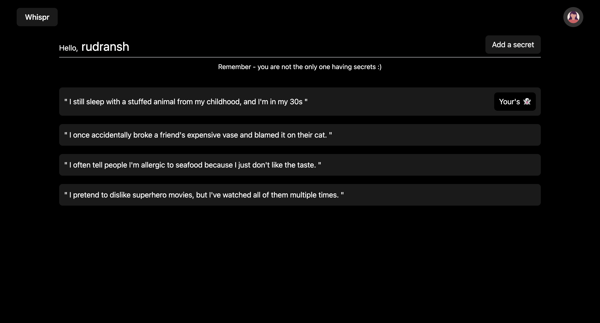

```bash
  Note- API is hosted on render , so it may take time up to 2 minutes to login or signup at first.
```
# Whispr

An react app built for sharing your secrets anonymous with others. Built with secure authentication with jwt.


## Demo
live link - 




## Setup

This project requires ReactJS (version 16 or later) and NPM(6 or later) whch are really easy to install. To make sure you have them available on your machine, try running the following command.

```bash
  npm -v
```

clone the project locally

```bash
  git clone https://github.com/ruds18/whispr.git
```

It has two parts the frontend and the backend , for frontend, in root directory

```bash
   npm i 
```

Starting the frontend

```bash
   npm run dev
```

For backend


```bash
   cd server/
```

```bash
   npm i
```

Starting the server

```bash
   npm run dev
```

note - mongoDB credentials are already added , for easy start.

Yay! now you are all set ! 👍 . Enter your secret 🤫 ...

